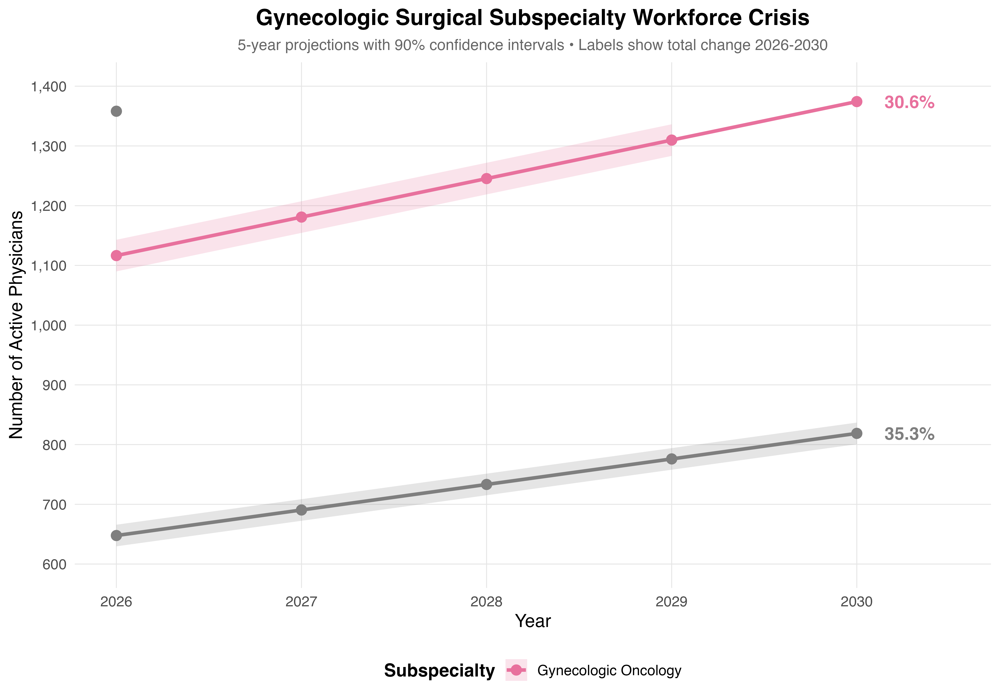
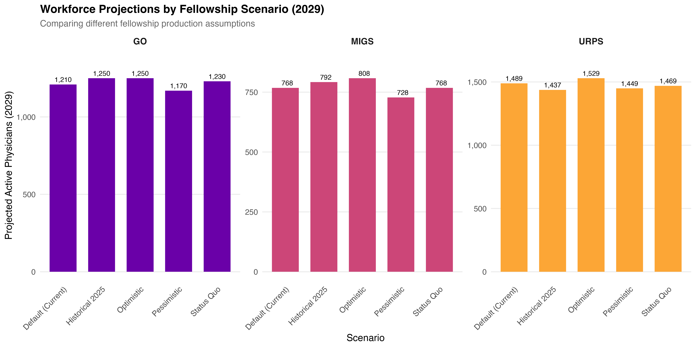
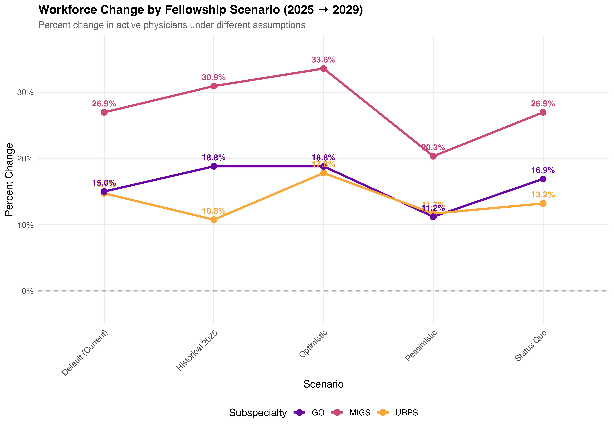
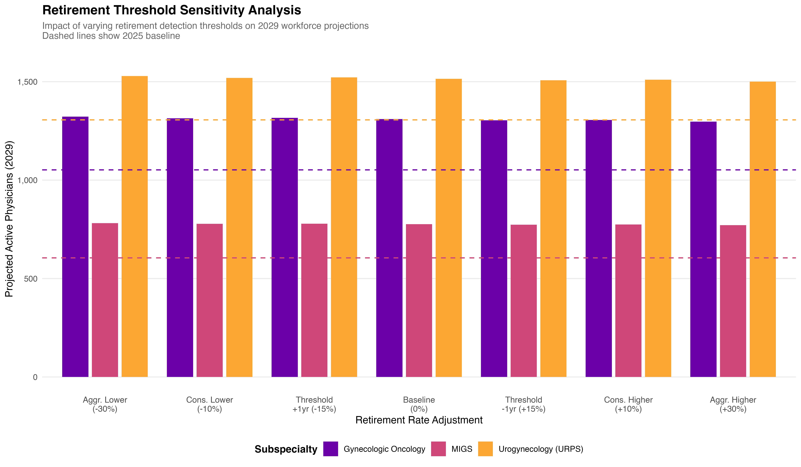
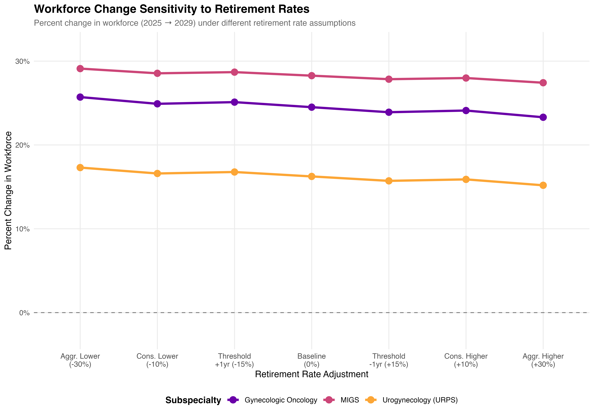
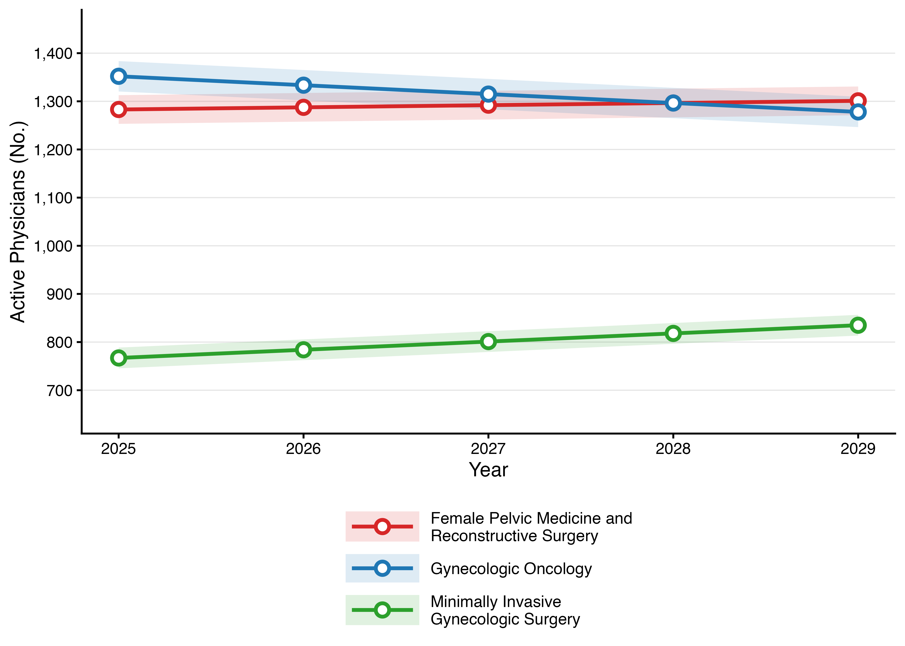
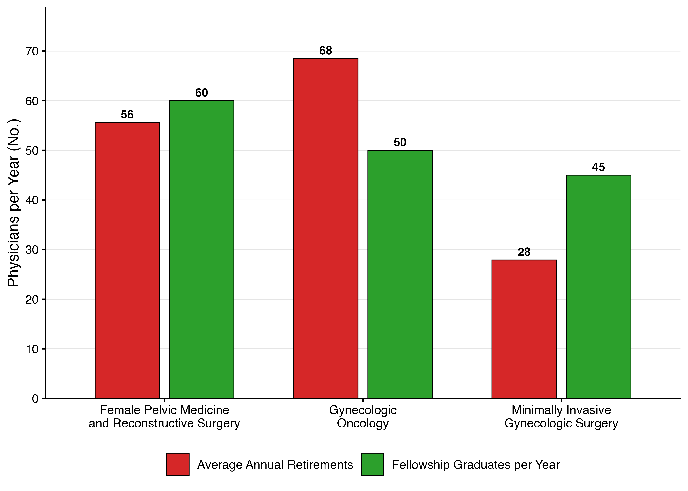
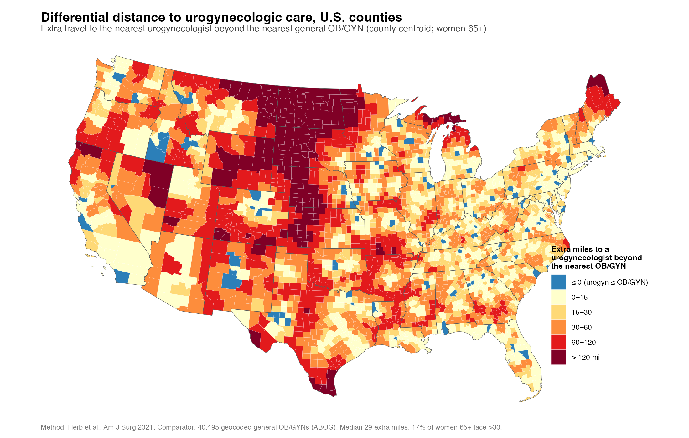

# Gynecologic Subspecialty Workforce Cliff

**Title:** Gynecologic Subspecialty Workforce Vulnerability: Retirement Approaches or Exceeds Fellowship Replacement Capacity

**Authors:** Tyler Muffly, MD · Sydney Archer, MD, MPH  
**Affiliation:** Denver Health Medical Center / University of Colorado School of Medicine  
**Target Journal:** Obstetrics & Gynecology  
**Status:** Under review (2026)

> **Presented** as an oral presentation at the 52nd Annual Meeting of the Society of Gynecologic Surgeons, Phoenix, AZ, March 2026.



*Five-year projections for the three gynecologic surgical subspecialties with 90%
confidence intervals; labels give total change 2026→2030. Gynecologic oncology
declines (−6.8%) while MIGS grows (+11.1%) and urogynecology is flat (+1.8%) —
the divergence the paper is about. Generated by `code/03_create_abstract_figure.R`.*

---

## Quick Start

```bash
git clone git@github.com:mufflyt/cliff.git
cd cliff
Rscript code/00_RUN_ALL.R
```

Produces all figures, tables, and a rendered manuscript in ~4 seconds. No external data required — seed data is committed to `data/`.

---

## Prerequisites

R ≥ 4.3 and the following packages:

```r
install.packages(c(
  "tidyverse", "here", "yaml", "scales",
  "knitr", "kableExtra", "rmarkdown",
  "gtsummary", "flextable", "jsonlite", "testthat"
))
```

---

## Repository Structure

```
cliff/
├── code/
│   ├── 00_RUN_ALL.R                    # Master pipeline (run this)
│   ├── 01_consolidate_workforce_data.R # Re-run Monte Carlo (optional)
│   ├── 02_create_figures.R             # Figure 1 & 2
│   ├── 03_create_abstract_figure.R     # SGS abstract figure
│   ├── 04_compare_scenarios.R          # Fellowship sensitivity
│   ├── 05_validate_with_monte_carlo.R  # Monte Carlo validation
│   ├── 06_retirement_sensitivity.R     # Retirement threshold sensitivity
│   ├── 07_create_table1.R             # Demographics table
│   ├── 08_pairwise_comparisons.R       # Pairwise scenario comparisons
│   └── workforce_statistics.R          # Inline statistics helpers
├── config/
│   └── fellowship_assumptions.yml      # 5 fellowship scenarios
├── data/
│   └── workforce_projections_consolidated.csv   # Seeded from manuscript
├── manuscript/
│   ├── WORKFORCE_CLIFF_ObGyn.Rmd       # Manuscript source (ObGyn format)
│   ├── Surgical_workforce_cliff_FINAL.txt
│   ├── Surgical_workforce_cliff_REVISED.txt
│   └── Surgical_workforce_cliff_CORRECTED.txt
├── figures/                            # Generated at runtime
├── app/
│   ├── app.R                           # Standalone Shiny retirement cliff app
│   └── R/helpers_retirement_cliff.R
├── scripts/
│   └── fig_fpmrs_supply_line.R         # Static FPMRS supply/demand figure
├── tests/testthat/
│   └── test-cliff-workforce-scripts.R
└── outputs/runs/                        # Timestamped run archives
```

---

## Pipeline Scenarios

```bash
Rscript code/00_RUN_ALL.R                # default (current best estimates)
Rscript code/00_RUN_ALL.R optimistic     # +10 fellows/yr each subspecialty
Rscript code/00_RUN_ALL.R pessimistic    # -10 fellows/yr each subspecialty
Rscript code/00_RUN_ALL.R historical_2025
Rscript code/00_RUN_ALL.R status_quo
```

Step 1 is skipped when `data/workforce_projections_consolidated.csv` already exists. To force a rebuild from raw Monte Carlo inputs:

```bash
CLIFF_FORCE_REBUILD=1 Rscript code/00_RUN_ALL.R
```

### Scenario comparison



*2029 headcount under each fellowship-production assumption. The spread is narrow —
roughly ±3% around the default for GO and URPS — because fellowship inflow is a
small annual increment against a large standing stock. Generated by
`code/04_compare_scenarios.R`.*



*The same five scenarios as percent change. MIGS is the most scenario-sensitive
(20.3%–33.6%); GO and URPS move less and track each other closely.*

### Retirement-threshold sensitivity

Because retirement is *detected* rather than reported, the projection depends on
where the detection threshold is set. `code/06_retirement_sensitivity.R` sweeps it
±30% and shifts it ±1 year:



*Projected 2029 headcount at each threshold; dashed lines mark the 2025 baseline.
Every subspecialty stays above its baseline across the full sweep.*



*The same sweep as percent change. Across a ±30% swing in the retirement rate the
projected change moves by only ~2 percentage points per subspecialty — the
headline direction is **not** sensitive to the retirement threshold.*

---

## Key Findings

### Workforce Projections (2025 → 2029, Monte Carlo 10,000 iterations)

| Subspecialty | 2025 | 2029 (95% CI) | Change | Fellows/yr | Retirements/yr | Ratio | Status |
|---|---|---|---|---|---|---|---|
| **FPMRS** | 1,283 | 1,301 (1,271–1,330) | +1.4% | 60 | 55.6 | **1.08** | Marginal |
| **Gynecologic Oncology** | 1,352 | 1,278 (1,246–1,310) | −5.5% | 50 | 68.5 | **0.73** | Insufficient |
| **MIGS** | 767 | 835 (814–857) | +8.9% | 45 | 27.9 | **1.61** | Adequate |



***Figure 1. Workforce trajectories, 2025–2029.*** *Gynecologic oncology (blue)
crosses below FPMRS (red) by 2028; MIGS (green) grows steadily off a smaller base.
Bands are 95% Monte Carlo intervals. Generated by `code/02_create_figures.R`.*



***Figure 2. The replacement gap.*** *Average annual retirements (red) against
fellowship graduates per year (green). Only gynecologic oncology is under water —
68 retirements against 50 graduates — while FPMRS is near parity (56 vs 60) and
MIGS has headroom (28 vs 45). Generated by `code/02_create_figures.R`.*

### Annual Retirement Rates
- GO: 5.2% — highest risk, replacement ratio **insufficient** (0.73)
- FPMRS: 4.4% — marginal replacement (1.08); clinical capacity is the bottleneck
- MIGS: 3.4% — youngest subspecialty, robust growth

> [!IMPORTANT]
> **Two baselines are currently in the repo, and the figures above are the older one.**
> The three figures above were rendered 2026-07-25 from the manuscript baseline
> (FPMRS 1,283 · GO 1,352 · MIGS 767; replacement ratios 0.73–1.61). The committed
> `data/workforce_projections_consolidated.csv` was later rebuilt on the adopted
> **1,306** URPS baseline (commit `42fefcd`), and now reads URPS 1,306 → 1,514
> (+16.0%), GO 1,052 → 1,310 (+24.5%), MIGS 605 → 776 (+28.3%) with replacement
> ratios of **5.38 / 7.11 / 11.06 — all "Above replacement."** The scenario and
> sensitivity figures further down were generated from *that* rebuild.
>
> Because `code/02_create_figures.R` reads the same CSV, **re-running
> `code/00_RUN_ALL.R` today regenerates Figures 1–2 from the 1,306 baseline**, and
> they will no longer match the table above. Which baseline the manuscript ships on
> is not yet settled here — see
> [`URPS_CONTAINMENT_AND_BASELINE_NOTES.md`](URPS_CONTAINMENT_AND_BASELINE_NOTES.md).

### Validation
- Retirement algorithm validated against state medical board records: **94.4% agreement** (472/500)
- Observation period: 2013–2023 (3,066 active subspecialists in 2024)

---

## Shiny Apps

Interactive explorers built from this repo's model:

| App | What it does | Launch |
|---|---|---|
| **Urogynecology Workforce Replacement Explorer** | Projects active urogynecologist headcount under adjustable fellowship-inflow, departure-rate, and graduate-conversion scenarios | **[▶ Live app](https://tyler-muffly.shinyapps.io/urps-workforce-explorer/)** · `shiny::runApp("shiny_urps_scenarios")` |
| **Urogynecology Effective-Adequacy Explorer** | Supply-vs-demand adequacy and capacity margin, with a slider for urologists' share of clinical time in urogynecology — productivity-adjusted capacity, "beyond the head count" | **[▶ Live app](https://tyler-muffly.shinyapps.io/urps-adequacy-explorer/)** · `shiny::runApp("shiny_urps_adequacy")` |

Both apps can also be run locally from a clone with `shiny::runApp()`.

### Interactive map

**Urogynecology geographic access** — a self-contained Leaflet map: county choropleth of
straight-line miles to the nearest urogynecologist, with every provider marked by board
pathway (ABU urology vs ABOG OB/GYN).

- File: [`outputs/urps_module_d_access_map_2026-07-23.html`](outputs/urps_module_d_access_map_2026-07-23.html) — download and open in a browser for the interactive version
- Rendered: [view online](https://htmlpreview.github.io/?https://github.com/mufflyt/cliff/blob/main/outputs/urps_module_d_access_map_2026-07-23.html) (via htmlpreview; may take a moment to load the ~2.4 MB widget)
- Regenerate: `Rscript scripts/urps_module_d_map_2026-07-23.R`

### Differential distance to subspecialty care



*How much **farther** a woman must travel for urogynecologic care than for general
OB/GYN care, by county centroid (women 65+). Isolating the *differential* separates
subspecialty scarcity from general rural physician scarcity — a county that is far
from everything shows up pale, while a county with an OB/GYN but no urogynecologist
shows up dark. The Great Plains and northern Maine carry >120 extra miles; median
29 extra miles, and 17% of women 65+ face more than 30. Comparator is 40,495
geocoded general OB/GYNs; method after Herb et al., *Am J Surg* 2021. Generated by
`scripts/urps_module_d_differential_map.R`.*

---

## Geographic concentration & equity

Beyond the supply-vs-retirement count, cliff reports **how unevenly the workforce
is distributed** and **who it is** — the distributional lens the Sheps Center
pediatric-subspecialty model uses at the subnational level. Computed from the
committed de-identified roster (N = 1,339 — the active baseline, selected by the
shared `inmodel()` filter in [`R/in_model_baseline.R`](R/in_model_baseline.R) so
the geographic and concentration analyses cannot drift to different cohorts):

- Active urogynecologists practice in **only 386 of ~3,143 US counties** (87.7%
  have none); **county Gini 0.94**, state Gini 0.56, top-5 states = 38%.
- **96% urban / 1.1% rural**; 53% female; 5.7% IMG; 29.5% in a designated HPSA.


*Lorenz curves for the N = 1,339 active baseline. The county curve (blue) hugs the
axis until ~88% of counties have been passed — those counties hold zero
urogynecologists — then rises almost vertically, giving a Gini of 0.937. The state
curve (red) is far less extreme (0.564). Maldistribution is a county-level, not a
regional, phenomenon. Generated by `scripts/urps_concentration_equity_2026-08-01.R`.*

The `in_model_baseline` flag itself is **upstream-owned** (isochrones adopts
`in_model_baseline == TRUE` as the fail-closed active-in-year definition; the
count is contract-pinned as `rows_national 1339`). cliff consumes it and never
re-derives it — see [`docs/SSOT_LEDGER.md`](docs/SSOT_LEDGER.md) iteration 54.

Regenerate: `Rscript scripts/urps_concentration_equity_2026-08-01.R`
— see [`WORKFORCE_CONCENTRATION_EQUITY.md`](WORKFORCE_CONCENTRATION_EQUITY.md)
(metrics in `R/workforce_concentration_metrics.R`). The modeling precedent and a
paste-ready Methods paragraph are in
[`PEDS_SUBSPEC_MICROSIMULATION_COMPARISON.md`](PEDS_SUBSPEC_MICROSIMULATION_COMPARISON.md)
(Fraher et al., *Pediatrics* 2024;153(Suppl 2):e2023063678C).

---

## Figure index

Every figure in this README, what produces it, and which baseline it was rendered
from. All are committed; `.tiff` companions at publication resolution sit beside
each `.png`.

| Figure | File | Generator | Baseline |
|---|---|---|---|
| Abstract / hero (2026–2030) | `figures/workforce_crisis_abstract.png` | `code/03_create_abstract_figure.R` | manuscript |
| 1 · Workforce trajectories | `figures/figure1_workforce_trajectories.png` | `code/02_create_figures.R` | manuscript |
| 2 · Replacement gap | `figures/figure2_replacement_gap.png` | `code/02_create_figures.R` | manuscript |
| Fellowship scenarios, 2029 level | `figures/scenario_comparison.png` | `code/04_compare_scenarios.R` | 1,306 rebuild |
| Fellowship scenarios, % change | `figures/scenario_comparison_change.png` | `code/04_compare_scenarios.R` | 1,306 rebuild |
| Retirement sensitivity, 2029 level | `figures/retirement_sensitivity_workforce.png` | `code/06_retirement_sensitivity.R` | 1,306 rebuild |
| Retirement sensitivity, % change | `figures/retirement_sensitivity_change.png` | `code/06_retirement_sensitivity.R` | 1,306 rebuild |
| Differential distance map | `outputs/urps_differential_distance_map_2026-07-23.png` | `scripts/urps_module_d_differential_map.R` | roster (N = 1,339) |
| Concentration Lorenz curves | `figures/urps_concentration_lorenz_2026-08-01.png` | `scripts/urps_concentration_equity_2026-08-01.R` | roster (N = 1,339) |
| Access map (interactive) | `outputs/urps_module_d_access_map_2026-07-23.html` | `scripts/urps_module_d_map_2026-07-23.R` | roster (N = 1,339) |

The "Baseline" column is the split described in the
[Key Findings](#key-findings) note: the manuscript figures and the scenario /
sensitivity figures were rendered from different versions of
`data/workforce_projections_consolidated.csv` and do not currently agree. The
roster-derived figures are independent of both — they read the committed enriched
rosters through the shared `inmodel()` filter.

---

## Data Sources

| Source | Years | Purpose |
|---|---|---|
| ABOG certification records | 2013–2024 | Subspecialty identification |
| NPPES | 2013–2024 | Practice locations, demographics |
| Medicare Part B claims | 2013–2022 | Retirement detection |
| Medicare Part D prescriber | 2013–2022 | Retirement detection |
| CMS Open Payments | 2013–2023 | Retirement detection |
| PECOS enrollment | 2013–2024 | Retirement detection |
| Physician Compare | 2013–2023 | Status changes |
| State medical boards (CA, TX, FL, WA) | Validation | Algorithm validation |
| ACGME program data | 2022–2024 | Fellowship pipeline |

All sources are publicly available and de-identified. IRB review not required.

---

## Provenance & upstream (`isochrones` monorepo)

This repository was extracted from the private **[`isochrones`](https://github.com/mufflyt/isochrones)** monorepo, which is where the raw
physician-level data (identifiable NPPES/ABOG/ABU/Medicare records) is assembled and
where many of the committed artifacts in `data/` are first produced. **cliff vends the
derived, de-identified artifacts** (departure hazards, roster crosswalks, workforce
projections, the supply-demand tables) — not the raw inputs.

Practically, this means:

- **Self-contained for analysis.** Rendering the manuscript and running the model from
  the committed artifacts needs only this repo (paths resolve through `here()` at the
  repo root; package versions are pinned in `renv.lock`).
- **Not self-contained for re-derivation.** A handful of *upstream* regeneration scripts
  (`scripts/departure_anchor.R`, `scripts/hierarchical_hazard_partial_pooling.R`,
  `scripts/build_hazard_comparison.R`, `scripts/abu_pathway_sensitivity.R`,
  `scripts/scenario_projection_trajectories.R`) read raw data from the isochrones
  monorepo (e.g. `<isochrones>/manuscript/tables/table1_physician_characteristics.csv`,
  `<isochrones>/data/abu_urology/…`). To rebuild the vended artifacts from scratch you
  need that monorepo; the raw identifiable data intentionally does not live here.

See [`URPS_CONTAINMENT_AND_BASELINE_NOTES.md`](URPS_CONTAINMENT_AND_BASELINE_NOTES.md)
for the exact boundary and the one open reconciliation item (the 1,295 vs 1,339
both-pathway baseline).

---

## From RStudio

Open `RUN_FROM_RSTUDIO.R` and click **Source**, or:

```r
setwd("~/cliff")
source("code/00_RUN_ALL.R")
```

---

## Contact

**Tyler Muffly, MD**  
Department of Obstetrics and Gynecology  
Denver Health Medical Center · University of Colorado School of Medicine  
777 Bannock Street, Denver, CO 80204  
tyler.muffly@dhha.org  
GitHub: [mufflyt/cliff](https://github.com/mufflyt/cliff)

---

## License

MIT License — see [LICENSE](LICENSE).  
All data sources are publicly available and de-identified.

---

*Last updated: 2026-08-02*
