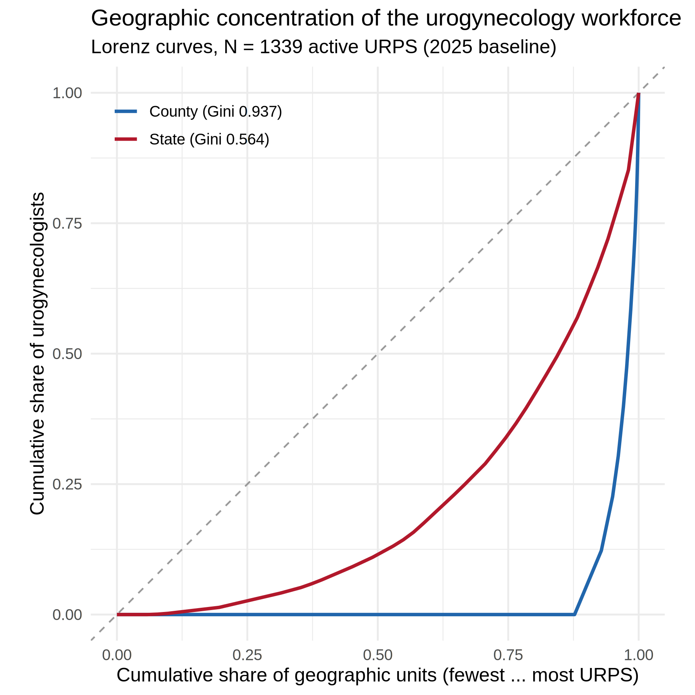

# Urogynecology workforce: geographic concentration & equity

**Motivation.** cliff’s core result is a supply-vs-retirement *count*.
The Sheps pediatric-subspecialty model (see
[`PEDS_SUBSPEC_MICROSIMULATION_COMPARISON.md`](https://mufflyt.github.io/cliff/PEDS_SUBSPEC_MICROSIMULATION_COMPARISON.md))
makes the case that a nationally adequate headcount can hide severe
subnational maldistribution, and that *who* and *where* the workforce is
matters as much as *how many*. This module adds that distribution/equity
lens to cliff using the existing de-identified roster — no new data
collection.

- **Metrics code:** `R/workforce_concentration_metrics.R` (Gini, HHI,
  Lorenz, top-k, rate dispersion, equity breakdown) — base-R/dplyr, runs
  from a bare clone.
- **Driver:** `scripts/urps_concentration_equity_2026-08-01.R`
- **Tests:** `tests/testthat/test-concentration-equity.R`
- **Figure:** `figures/urps_concentration_lorenz_2026-08-01.png` (+
  `.tiff`; Lorenz curves)
- **Tables:** `data/urps_concentration_by_geography_2026-08-01.csv`,
  `data/urps_equity_demographics_2026-08-01.csv`,
  `data/urps_lorenz_states_2026-08-01.csv`,
  `data/urps_provider_rate_dispersion_2026-08-01.csv`

**Cohort:** N = 1,339 active urogynecologists (URPS) in the 2025 model
baseline (1,031 ABOG pathway + 308 ABU pathway), selected by the shared
[`inmodel()`](https://mufflyt.github.io/cliff/reference/inmodel.md)
filter in `R/in_model_baseline.R` — the single source of truth every
URPS module uses to read the upstream `in_model_baseline` flag, so this
cohort cannot differ from the one behind the Module D geographic
figures.

------------------------------------------------------------------------

## 1. Geographic concentration

| Geography | Units | Occupied | % units with **zero** URPS | Gini | HHI | Top-5 share |
|----|---:|---:|---:|---:|---:|---:|
| US county | 3,143 | **386** | **87.7%** | **0.937** | 0.006 | 10.1% |
| US state (incl. DC) | 51 | 48 | 5.9% | **0.564** | 0.051 | 38.4% |
| ACOG district (I–XII, excl. 27 unknown) | 11 | 11 | 0% | 0.171 | 0.100 | — |

**Read:** - **Counties are profoundly maldistributed.** Urogynecologists
practice in only **386 of ~3,143 US counties** — **87.7% of counties
have none**, and the county Lorenz curve is extreme (Gini 0.937). -
**State concentration is high too:** the top 5 states hold **38%** of
the workforce and the top 10 hold **57%**. California alone has 194
(14.5%), followed by NY (88), TX (85), FL (72), PA (64). - **Across ACOG
districts the spread is comparatively even** (Gini 0.171; range 72–194
members), i.e. maldistribution is a *within-region, county-level*
phenomenon, not a coarse regional one — the same lesson the pediatric
model drew at the division level.

**County access-rate dispersion** (urogynecologists per 100k women 65+,
among the 1,052 with a county denominator): median **9.2**, IQR
6.3–14.1, and a **90:10 ratio of 5.8** — the best-served decile of
providers sits in counties with roughly six times the per-capita supply
of the least-served decile.



Lorenz curves

------------------------------------------------------------------------

## 2. Workforce composition & access equity

Counts (within-column %) by board pathway and overall (N = 1,339):

| Characteristic | ABU (n=308) | ABOG (n=1,031) | Overall |
|----|----|----|----|
| **Female** | 150 (48.7%) | 560 (54.3%) | **710 (53.0%)** |
| **US MD** | 247 (80.2%) | 800 (77.6%) | 1,047 (78.2%) |
| **US DO** | 4 (1.3%) | 38 (3.7%) | 42 (3.1%) |
| **International medical graduate (IMG)** | 1 (0.3%) | 75 (7.3%) | **76 (5.7%)** |
| **Urban practice** | 294 (95.5%) | 993 (96.3%) | **1,287 (96.1%)** |
| **Suburban** | 11 (3.6%) | 23 (2.2%) | 34 (2.5%) |
| **Rural** | 2 (0.6%) | 13 (1.3%) | **15 (1.1%)** |
| **Practices in a designated HPSA** | 78 (25.3%) | 317 (30.7%) | **395 (29.5%)** |

*(Med-school class / IMG status carry a ~12% “Unknown” bucket, sourced
best-available from Physician Compare → GOBA → Doximity; IMG for the ABU
pathway is a lower bound.)*

**Read:** - The workforce is **53% female**, and **essentially
non-rural**: only **1.1%** practice in rural areas versus 96% urban — a
stark access finding for a subspecialty serving an aging, geographically
dispersed population. - **IMGs differ sharply by pathway** (ABOG 7.3% vs
ABU 0.3%), a composition signal worth flagging when the two pathways are
pooled into one workforce. - Nearly **3 in 10 practice inside a
designated Health Professional Shortage Area**, but that reflects where
dense metros overlap HPSA tracts, not rural reach — consistent with the
rurality finding.

------------------------------------------------------------------------

## Paste-ready manuscript text

> Beyond aggregate supply, the urogynecology workforce is highly
> maldistributed geographically. Active urogynecologists practiced in
> only 386 of approximately 3,143 US counties (87.7% of counties had
> none), with a county-level Gini coefficient of 0.94 and a state-level
> Gini of 0.56; the five highest-supply states accounted for 38% of the
> workforce. County-level access varied nearly six-fold between the
> best- and least-served deciles (23.4 vs 4.0 per 100 000 women aged ≥65
> at the 90th vs 10th percentile; ratio 5.8). The workforce was 53.0%
> female and 5.7% international medical graduates, and was almost
> entirely urban: only 1.1% practiced in rural areas, while 29.5%
> practiced within a designated Health Professional Shortage Area. These
> distributional findings indicate that even where the national
> replacement ratio appears adequate, access is concentrated in a small
> number of metropolitan counties.

## Reproduce

``` r
Rscript scripts/urps_concentration_equity_2026-08-01.R
# optional true maldistribution (population-weighted) Gini, needs a Census API key:
CLIFF_PULL_ACS=1 Rscript scripts/urps_concentration_equity_2026-08-01.R
```

*Numbers above were computed from the committed enriched rosters
(`data/abog_all_urps_ENRICHED_2026-07-22.csv`,
`data/abu_all_urps_ENRICHED_2026-07-22.csv`, baseline N = 1,339).*
