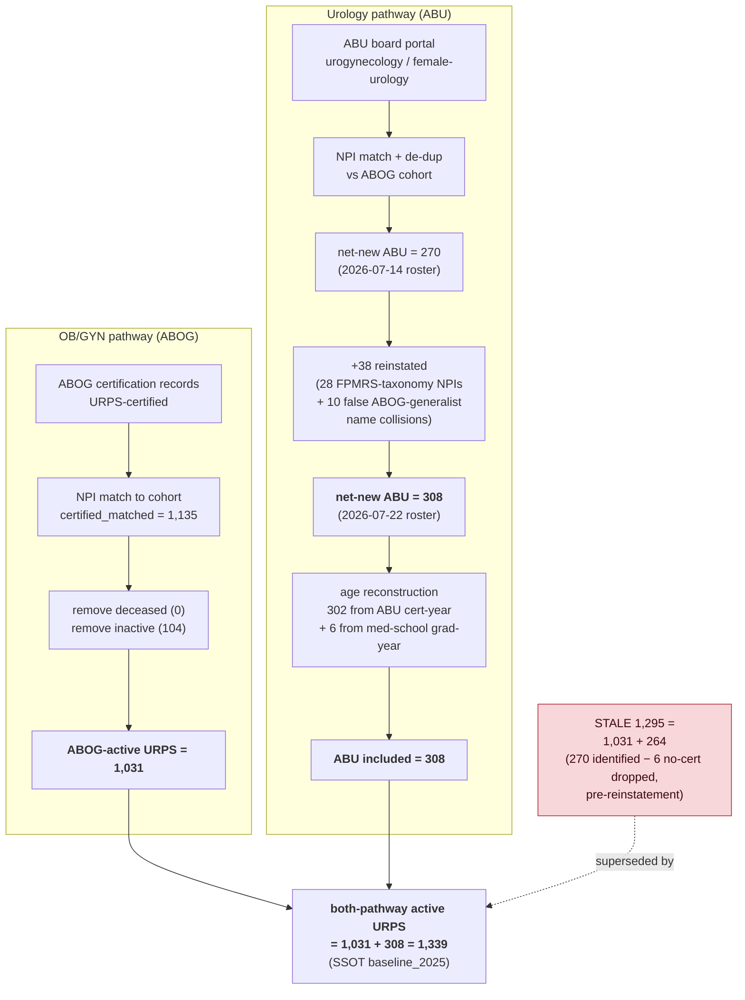

> # ⚠ ARCHIVAL — NON-AUTHORITATIVE
> **Superseded 2026-07-27 by the three-repo SSOT charter (see [`docs/CHARTER_cliff.md`](CHARTER_cliff.md)).**
> This document records the historical 1,295-vs-1,339 diagnosis. It is **not** the source of truth and must
> **not** be read to establish a baseline. Under the charter the national URPS baseline is owned by the
> isochrones provider snapshot, validated and served by `mufflyaccess::urps_count()`, and consumed by cliff
> only through `R/urps_baseline.R`. cliff cannot redefine the baseline. Kept for provenance/history only.

# The URPS baseline SSOT: reconciling 1,295 vs 1,339  *(ARCHIVAL)*

**Status (2026-07-24):** diagnosed and computed; **not yet applied** to the frozen
analysis. The frozen SSOT still reads **1,295**; the correct current value is **1,339**.
Applying it is a scoped re-run (see [§7 Blast radius](#7-blast-radius)).
**(2026-07-27: reconciliation is now owned by the isochrones -> mufflyaccess chain; cliff consumes the served
value via `R/urps_baseline.R`. See the archival banner above.)**

---

## 1. The single source of truth

There must be exactly one authoritative "how many urogynecologists are there" number,
and every other place must reference it, not bake in a literal.

| Layer | Where | Accessor |
|---|---|---|
| **Canonical value** | `data/workforce_projections_consolidated.csv`, URPS row, column `baseline_2025` | `get_baseline("URPS")` (defined in `manuscript/R/workforce_statistics.R`) |
| Supply/Shiny lineage | `shiny_urps_scenarios/urps_model_data.R` → `URPS_AGES` (a frozen age vector) | `length(URPS_AGES)` |

`get_baseline("URPS")` is the canonical CODE accessor. Any script that needs the total
should call it (or read the SSOT column) rather than hardcode `1295`/`1339`.

**The bug this doc fixes:** the two layers disagree. The **supply lineage already uses
1,339** (`app.R` guard asserts `BASELINE == 1339`; `URPS_AGES` has length 1,339; the model
test asserts the roster sums to 1,339). The **headcount SSOT lineage uses 1,295**
(`workforce_projections_consolidated.csv`, `consort_cohort_flow.csv`, the supplement, and
~35 tests). They describe the *same* both-pathway workforce, so one is wrong. **1,339 is
current-and-correct; 1,295 is stale.**

---

## 2. How we get to 1,339 (flowchart)

---

## 3. The 44-physician gap, exactly

ABOG-active URPS is **1,031 in both** lineages. The entire gap is ABU:

| | ABOG-active | ABU included | Total |
|---|---|---|---|
| **Stale (1,295)** | 1,031 | **264** = 270 identified − 6 no-cert dropped (07-14 roster) | 1,295 |
| **Correct (1,339)** | 1,031 | **308** = 270 + 38 reinstated, all aged (302 cert-year + 6 grad-year) | 1,339 |

**Gap = 44 = 38 reinstated + 6 no-longer-dropped.** The stale value predates *both* the
2026-07-22 ABU reinstatement *and* the graduation-year aging of the 6 physicians who lack a
datable certification year. The manuscript body already describes the 308-ABU roster, so
the frozen SSOT (1,295) contradicts the paper's own text.

**A third number, 1,333**, appears if you re-run the live engine: `wc_load_abu_ages()`
keeps only ABU with a cert-year (302), dropping the 6, so `1,031 + 302 = 1,333`. The
frozen `URPS_AGES` (1,339) ages all 308 and is authoritative; the live engine is lossy by 6
because the ABU crosswalk carries only `abu_cert_year` (no graduation year). Fixing the
engine to reproduce 1,339 requires wiring graduation-year data it does not currently read.

---

## 4. Reconciled SSOT row (computed, not yet applied)

Re-deriving the URPS row from the authoritative 1,339 roster (partial-pooled primary
hazard `HAZ_WINDOWS$fully_obs` applied via `wc_project(URPS_AGES, entrants = 64)`; sd held
at the frozen Monte-Carlo value):

| Field | Frozen (stale) | Reconciled |
|---|---|---|
| `baseline_2025` | 1,295 | **1,339** |
| `annual_retirement_rate` (%) | 0.88094 | 0.95252 |
| `avg_annual_retirements` | 11.408 | 12.754 |
| `projected_2029` | 1,505.37 | 1,543.98 |
| `replacement_ratio` | 5.61 | **5.02** |
| `percent_change` (%) | 16.24 | 15.31 |
| `total_retirements_4yr` | 46 | 51 |
| `ci95_lower / upper` | 1,476 / 1,535 | 1,514 / 1,574 |
| `annual_entrants`, `fellowship_total_4yr`, `sd_2029` | 64, 256, 15.2 | unchanged |

Notably the reconciled ratio (**5.02**) equals what the supply/Shiny lineage already
reports ("manuscript primary, ratio 5.02" in `urps_model_data.R`), so adopting 1,339 makes
the two lineages agree. The conclusion is unchanged: **well above one-for-one replacement.**

The contract (`workforce_data_contract.R`) validates these: `projected = baseline +
4·(entrants − retirements)` → `1339 + 4·(64 − 12.754) = 1543.98` ✓; `ratio =
entrants/retirements = 64/12.754 = 5.02` ✓.

---

## 5. Every place the urogyn total is referenced (audit)

| Site | Kind | Lineage | Value today |
|---|---|---|---|
| `data/workforce_projections_consolidated.csv` (`baseline_2025`) | data (canonical) | headcount | 1,295 |
| `get_baseline("URPS")` (`workforce_statistics.R`) | accessor | headcount | reads SSOT |
| `data/consort_cohort_flow.csv` (`active_baseline_final`) | data | headcount | 1,295 |
| `scripts/rebuild_ssot_revised.R` | producer | headcount | 1,295 hardcoded |
| `manuscript/supplement_WORKFORCE_CLIFF.Rmd` (App. Table S7 text) | prose | headcount | "1,031 + 264 = 1,295" |
| `shiny_urps_scenarios/urps_model_data.R` (`URPS_AGES`) | data | **supply** | **1,339** |
| `shiny_urps_adequacy/data/urps_model_data.R` (`URPS_AGES`) | data | **supply** | **1,339** |
| `shiny_urps_scenarios/app.R` (`BASELINE == 1339` guard) | code guard | **supply** | **1,339** |
| `shiny_urps_scenarios/tests/.../test-model-functions.R` | test | **supply** | **1,339** |
| `augs_application/scripts/cms_supply_demand_10styles.R` (`1339 * w65_index`) | code (compute) | supply | **1,339** hardcoded |
| ~35 assertions across `tests/testthat/test-workforce-cliff-*` | tests | headcount | 1,295 / 5.61 / 264 |

**Single-source rule going forward:** the headcount sites above should be regenerated to
1,339, and `cms_supply_demand_10styles.R` should read `get_baseline("URPS")` instead of the
literal `1339`, so the number lives in exactly one file.

---

## 6. Why the SSOT is hand-frozen

Per `PROVENANCE.md`, `workforce_projections_consolidated.csv` has **no live producer** — its
rate, projection, sd, and ratio came from a one-off 2025-09-28 model run. `URPS_AGES` is
likewise a frozen "auto-generated, do not hand-edit" vector. So the two lineages were frozen
at different moments: the supply vector after the ABU reinstatement (1,339), the headcount
SSOT before it (1,295).

---

## 7. Blast radius

Adopting 1,339 is **not** a value edit — the SSOT ratio (5.61) and baseline (1,295) are the
reconciliation anchor for the entire frozen sensitivity suite. Changing them breaks ~35
tests across five files because each of these artifacts was computed on the 1,295 roster and
must be **re-derived on 1,339**:

- the audit table (`build_audit_table.R`)
- `open_payments_sensitivity.csv`, `mortality_sensitivity.csv`, `baseline_lag_decomposition.csv`
- `breakeven_thresholds.csv`, `graduate_growth_scenarios.csv`, `sensitivity_grid_summary.csv`
- age-shift and NRMP-benchmark sensitivities
- `consort_cohort_flow.csv` + its H2/H4 CONSORT tests
- Table 1/Table 2 numbers and the Hall-of-Shame value pins

None of these have re-runnable producers, so a faithful adoption of 1,339 is a **re-run of
the frozen workforce analysis**, not an edit. (Separately, a few of these test files also
assume the pre-reframe "National Headcount Balance" title/abstract and are red from the
supply-and-demand reframe.)

---

## 8. Application plan (when authorized)

1. Regenerate the SSOT URPS row to §4 (via `rebuild_ssot_revised.R` updated to the new row,
   or a re-run of the projection/MC).
2. Regenerate every sensitivity artifact in §7 on the 1,339 roster.
3. Update `consort_cohort_flow.csv` URPS row to `1135,0,104,1031,308,1339,308,0,308` and the
   supplement App. Table S7 text to "1,031 + 308 = 1,339".
4. Update the ~35 Hall-of-Shame / reconciliation test pins to the new values.
5. Point `cms_supply_demand_10styles.R` (and any other compute site) at `get_baseline("URPS")`.
6. Fix `wc_load_abu_ages()` to age the 6 no-cert ABU from graduation year so the live engine
   reproduces 1,339 (needs graduation-year data wired into the ABU loader).
7. Re-render the manuscript and confirm Table 1/2, the abstract, and every sensitivity
   reconcile at 1,339 / ratio 5.02.
